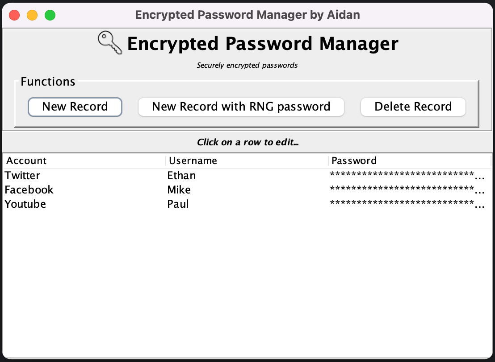

# Encrypted Password Manager

Encrypted password manager built in Java using Swing.
Passwords are encrypted using AES and stored in a SQLite database.

## Features

- Swing graphical user interface.
- AES Encrypted password storage with external encryption key([key.txt](src%2Fmain%2Fresources%2Fkey.txt)).
- Create new records which store Account, Username, Password.
- Edit/view existing records.
- Delete records.
- Create record with randomly generated password.

## GUI

